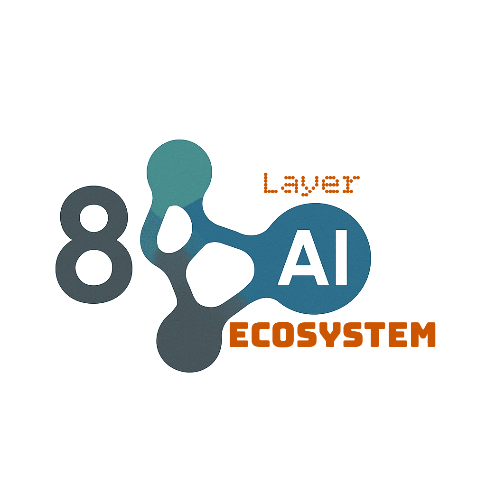

# ERP by Layer 8

<p align="center">
  
</p>

<p align="center">
  <strong>Enterprise Resource Planning System</strong><br>
  Built for the Modern Enterprise
</p>

<p align="center">
  
  
  
  
  
  
</p>

<p align="center">
  <a href="https://www.l8erp.one"><strong>Live Site</strong></a>
</p>

---

## Overview

ERP by Layer 8 is a comprehensive Enterprise Resource Planning system built from the ground up with Go. It provides a unified platform for managing all aspects of an organization — from financial operations and human capital to supply chain, manufacturing, sales, and beyond.

With **13 modules**, **256 business services**, and **79 protobuf schemas** defining **673 message types** and **300 enums**, the system covers the complete enterprise lifecycle:

- **Financial Management** — GL, AP, AR, Cash, Fixed Assets, Budgeting, Tax
- **Human Capital** — Core HR, Payroll, Benefits, Talent, Learning, Compensation, Time & Attendance
- **Supply Chain** — Procurement, Inventory, Warehouse, Logistics, Planning
- **Manufacturing** — Engineering, Production, Planning, Quality, Costing, Shopfloor
- **Sales & Distribution** — Customers, Orders, Pricing, Shipping, Billing, Analytics
- **CRM** — Accounts, Leads, Opportunities, Campaigns, Field Service
- **Project Management** — Planning, Resources, Time & Expense, Billing, Analytics
- **Business Intelligence** — Dashboards, Reports, Analytics, KPIs, Data Management
- **Document Management** — Storage, Workflows, Signatures, Compliance, Integration
- **E-Commerce** — Catalog, Orders, Customers, Promotions
- **Compliance & Risk** — Regulatory, Controls, Risk, Audit
- **Lending** — Loan Products, Applications, Credit Lines, Collateral, Payments
- **System Administration** — Module Selection, Dependencies, Configuration

Part of the **Layer 8 Ecosystem**, this ERP system benefits from shared infrastructure components including ORM, serialization, service framework, virtual networking, and web server.

## Features

- **256 Business Services** across 13 integrated modules
- **6 Role-Based Portals** — Employee Self-Service, Manager, Customer, Vendor, Partner, and Project Client portals (desktop + mobile)
- **8 Data View Types** — Table, Chart, Kanban, Calendar, Timeline, Gantt, Tree Grid, and Wizard with per-service view switching
- **Desktop + Mobile Apps** — full-featured web and mobile interfaces with complete view parity
- **AI Agent** — integrated AI chat assistant with contextual ERP knowledge
- **Dashboard** — cross-module statistics and KPI overview
- **Module Selection** — enable/disable modules at runtime with automatic dependency management
- **System Dependency Map** — visual module dependency graph for configuration
- **Data Import** — CSV, JSON, and XML import with AI-assisted column mapping
- **Multi-Currency Support** — real-time exchange rate conversion across all financial fields
- **Protobuf Data Model** — 79 schema files defining 673 message types with cross-module references
- **Mock Data Generation** — realistic test data generators covering all 256 services with phased dependency ordering
- **Validation Framework** — declarative validation builder with required fields, enums, and reference checks
- **Factory-Driven UI** — shared factories for forms, columns, enums, references, sections, and SVG
- **Full Audit Trail** — complete transaction history across all modules
- **Marketing Site** — product landing page with architecture, modules, proof, and getting started pages
- **API-First Design** — RESTful APIs for all services with L8Query language
- **Kubernetes Native** — deploy on any K8s cluster with 6 included manifests
- **Zero Frontend Dependencies** — pure vanilla JavaScript, no build step required
- **Comprehensive Tests** — 27 test files covering service getters and handlers across all modules

## Modules

| Module | Services | Description |
|--------|----------|-------------|
| **Human Capital (HCM)** | 58 | Core HR, Payroll, Benefits, Talent, Learning, Compensation, Time & Attendance |
| **Supply Chain (SCM)** | 30 | Procurement, Inventory, Warehouse, Logistics, Planning |
| **Financial Management (FIN)** | 29 | GL, AP, AR, Cash, Fixed Assets, Budgeting, Tax |
| **CRM** | 23 | Accounts, Leads, Opportunities, Campaigns, Marketing, Field Service |
| **Project Management (PRJ)** | 22 | Planning, Resources, Time & Expense, Billing, Analytics |
| **Manufacturing (MFG)** | 19 | Engineering, Production, Planning, Quality, Costing, Shopfloor |
| **Sales & Distribution** | 18 | Customers, Orders, Pricing, Shipping, Billing, Analytics |
| **Business Intelligence (BI)** | 14 | Dashboards, Reports, Analytics, KPIs, Data Sources |
| **E-Commerce (ECOM)** | 13 | Catalog, Orders, Customers, Promotions |
| **Document Management (DOC)** | 11 | Storage, Workflows, Signatures, Compliance, Integration |
| **Compliance & Risk (COMP)** | 11 | Regulatory, Controls, Risk, Audit |
| **Lending (LEND)** | 6 | Loan Products, Applications, Credit Lines, Collateral, Payments |
| **System Administration (SYS)** | 2 | Module Configuration & Dependencies |
| **Total** | **256** | |

## Quick Start

### Prerequisites

- Go 1.25 or later
- Docker (for PostgreSQL and deployment)

### Run Locally

```bash
# Clone the repository
git clone https://github.com/saichler/l8erp.git
cd l8erp/go

# Full local startup (builds, starts DB, loads mock data)
./run-local.sh

# Or run just the web server
go run ./erp/ui/main1/
```

### Access the Application

| Page | URL |
|------|-----|
| Marketing Site | http://localhost:2773/ |
| Login | http://localhost:2773/login/ |
| Desktop App | http://localhost:2773/app.html |
| Mobile App | http://localhost:2773/m/ |
| ESS Portal | http://localhost:2773/ess.html |
| Manager Portal | http://localhost:2773/mgr.html |
| Customer Portal | http://localhost:2773/customer.html |
| Vendor Portal | http://localhost:2773/vendor.html |
| Partner Portal | http://localhost:2773/partner.html |
| Project Client Portal | http://localhost:2773/projclient.html |

### Demo Credentials

| Field | Value |
|-------|-------|
| Username | `operator` |
| Password | `Oper123!` |

### Docker Deployment

```bash
# Build all images
./go/build-all-images.sh

# Or build individually
docker build -t erp-main -f go/erp/main/Dockerfile go/
docker build -t erp-web -f go/erp/ui/Dockerfile go/
```

### Kubernetes Deployment

```bash
# Deploy all components
cd k8s && ./deploy.sh

# Components (6 manifests):
#   vnet       (DaemonSet)    — Virtual network overlay
#   logs       (DaemonSet)    — Log aggregation vnet
#   erp        (StatefulSet)  — ERP backend services
#   web        (DaemonSet)    — Web UI on all nodes
#   log-agent  (DaemonSet)    — Log collection agent
#   maint      (Service)      — Maintenance operations

# Teardown
./undeploy.sh
```

## Project Structure

```
l8erp/
├── proto/                       # 79 Protocol Buffer definitions (~14,800 lines)
│   ├── erp-common.proto         #   Shared types (Money, Address, AuditInfo, DateRange)
│   ├── hcm-*.proto              #   HCM module (8 schemas)
│   ├── fin-*.proto              #   Financial module (8 schemas)
│   ├── scm-*.proto              #   SCM module (7 schemas)
│   ├── mfg-*.proto              #   Manufacturing module (7 schemas)
│   ├── sales-*.proto            #   Sales module (7 schemas)
│   ├── crm-*.proto              #   CRM module (7 schemas)
│   ├── prj-*.proto              #   Projects module (6 schemas)
│   ├── bi-*.proto               #   BI module (5 schemas)
│   ├── doc-*.proto              #   Documents module (5 schemas)
│   ├── ecom-*.proto             #   E-Commerce module (5 schemas)
│   ├── comp-*.proto             #   Compliance module (5 schemas)
│   ├── lend-*.proto             #   Lending module (7 schemas)
│   └── make-bindings.sh         #   Generates Go types from proto files
├── go/
│   ├── erp/
│   │   ├── common/              # Shared: validation builder, service factory, defaults
│   │   ├── services/            # Module activation (activate_hcm.go, activate_fin.go, ...)
│   │   ├── aia/                 # AI Agent (chat assistant)
│   │   ├── hcm/                 # Human Capital Management (58 services)
│   │   ├── fin/                 # Financial Management (29 services)
│   │   ├── scm/                 # Supply Chain Management (30 services)
│   │   ├── mfg/                 # Manufacturing (19 services)
│   │   ├── sales/               # Sales & Distribution (18 services)
│   │   ├── crm/                 # CRM (23 services)
│   │   ├── prj/                 # Project Management (22 services)
│   │   ├── bi/                  # Business Intelligence (14 services)
│   │   ├── doc/                 # Document Management (11 services)
│   │   ├── ecom/                # E-Commerce (13 services)
│   │   ├── comp/                # Compliance & Risk (11 services)
│   │   ├── lend/                # Lending (6 services)
│   │   ├── sys/                 # System Administration (2 services)
│   │   ├── main/                # ERP backend entry point + Dockerfile
│   │   ├── ui/                  # Web server + UI assets
│   │   │   ├── main1/           #   Web server entry point
│   │   │   └── web/             #   Web application root
│   │   │       ├── app.html     #     Desktop application shell
│   │   │       ├── ess.html     #     Employee Self-Service portal
│   │   │       ├── mgr.html     #     Manager portal
│   │   │       ├── customer.html #    Customer portal
│   │   │       ├── vendor.html  #     Vendor portal
│   │   │       ├── partner.html #     Partner portal
│   │   │       ├── projclient.html #  Project Client portal
│   │   │       ├── l8ui/        #     Shared UI library (submodule)
│   │   │       ├── erp-ui/      #     ERP-specific UI (SVG templates, section configs)
│   │   │       ├── sections/    #     Section HTML files (15 sections)
│   │   │       ├── dashboard/   #     Cross-module dashboard
│   │   │       ├── aia/         #     AI Agent UI
│   │   │       ├── hcm/         #     HCM UI (config, enums, columns, forms per submodule)
│   │   │       ├── fin/         #     Financial UI
│   │   │       ├── scm/         #     SCM UI
│   │   │       ├── mfg/         #     Manufacturing UI
│   │   │       ├── sales/       #     Sales UI
│   │   │       ├── crm/         #     CRM UI
│   │   │       ├── prj/         #     Projects UI
│   │   │       ├── bi/          #     BI UI
│   │   │       ├── documents/   #     Documents UI
│   │   │       ├── ecom/        #     E-Commerce UI
│   │   │       ├── comp/        #     Compliance UI
│   │   │       ├── lending/     #     Lending UI
│   │   │       ├── js/          #     Shared JS (reference registries, sections, utils)
│   │   │       ├── marketing/   #     Marketing site (architecture, modules, proof, start, about)
│   │   │       ├── m/           #     Mobile app + portals (full view parity with desktop)
│   │   │       └── login/       #     Login page
│   │   └── vnet/                # Virtual network layer + Dockerfile
│   ├── logs/                    # Log infrastructure
│   │   ├── agent/               #   Log collection agent + Dockerfile
│   │   └── vnet/                #   Log aggregation vnet + Dockerfile
│   ├── maint/                   # Maintenance service + Dockerfile
│   ├── types/                   # Generated Go types from protobuf (~138,900 lines)
│   ├── tests/                   # Test suite
│   │   ├── *_test.go            #   27 test files (getters + handlers per module)
│   │   └── mocks/               #   Mock data generators (130 files)
│   │       ├── data_*.go        #     Curated name/data arrays per module
│   │       ├── gen_*.go         #     Entity generators (80 files)
│   │       ├── *_phases*.go     #     Phase orchestration
│   │       ├── store*.go        #     Shared mock data store (ID slices per module)
│   │       └── utils.go         #     Helpers (pickRef, randomMoney, genID, genLines, ...)
│   ├── vendor/                  # Vendored Go dependencies
│   └── run-local.sh             # Full local development startup script
├── k8s/                         # 6 Kubernetes manifests + deploy/undeploy scripts
└── tools/                       # Dev tools (REST client, migration scripts)
```

## Architecture

```
┌───────────────────────────────────────────────────────────────┐
│                     Presentation Layer                         │
│   ┌─────────────┐  ┌─────────────┐  ┌─────────────┐          │
│   │ Desktop App │  │ Mobile App  │  │ REST API    │          │
│   │ (Vanilla JS)│  │ (Vanilla JS)│  │ Clients     │          │
│   └─────────────┘  └─────────────┘  └─────────────┘          │
├───────────────────────────────────────────────────────────────┤
│                     Application Layer                          │
│   ┌──────────┐ ┌──────────┐ ┌──────────┐ ┌──────────┐        │
│   │ Service  │ │ Validate │ │ Business │ │ Type     │        │
│   │ Framework│ │ Builder  │ │ Logic    │ │ Registry │        │
│   └──────────┘ └──────────┘ └──────────┘ └──────────┘        │
├───────────────────────────────────────────────────────────────┤
│                       Data Layer                               │
│   ┌──────────┐ ┌──────────┐ ┌──────────┐ ┌──────────┐        │
│   │ L8 ORM   │ │ Protobuf │ │ L8 Query │ │PostgreSQL│        │
│   │          │ │ Srlz     │ │ Language │ │          │        │
│   └──────────┘ └──────────┘ └──────────┘ └──────────┘        │
├───────────────────────────────────────────────────────────────┤
│                   Infrastructure Layer                         │
│   ┌──────────┐ ┌──────────┐ ┌──────────┐ ┌──────────┐        │
│   │Kubernetes│ │ Docker   │ │ L8 Bus   │ │ L8 Web   │        │
│   │          │ │          │ │ (VNet)   │ │ Server   │        │
│   └──────────┘ └──────────┘ └──────────┘ └──────────┘        │
└───────────────────────────────────────────────────────────────┘
```

## Technology Stack

| Layer | Technology |
|-------|------------|
| Backend | Go 1.25 |
| Database | PostgreSQL 14+ |
| Frontend | Vanilla JavaScript (zero dependencies, no build step) |
| UI Library | [l8ui](https://github.com/saichler/l8ui) (shared component framework) |
| API | REST with L8Query language |
| Serialization | Protocol Buffers |
| Container | Docker |
| Orchestration | Kubernetes |
| Networking | Layer 8 Bus (Virtual Network Overlay) |
| ORM | Layer 8 ORM with L8 Query Language |

## Layer 8 Ecosystem

This ERP is built on top of the Layer 8 open-source infrastructure:

| Component | Purpose |
|-----------|---------|
| [l8ui](https://github.com/saichler/l8ui) | Shared UI component library (tables, forms, charts, kanban, etc.) |
| [l8bus](https://github.com/saichler/l8bus) | Message bus and virtual network overlay |
| [l8orm](https://github.com/saichler/l8orm) | Object-relational mapping |
| [l8services](https://github.com/saichler/l8services) | Service framework (activation, callbacks, routing) |
| [l8web](https://github.com/saichler/l8web) | Web server framework |
| [l8reflect](https://github.com/saichler/l8reflect) | Reflection and introspection utilities |
| [l8srlz](https://github.com/saichler/l8srlz) | Serialization (protobuf-based) |
| [l8types](https://github.com/saichler/l8types) | Common types and interfaces |
| [l8utils](https://github.com/saichler/l8utils) | Shared utilities |
| [l8test](https://github.com/saichler/l8test) | Testing framework |

## Codebase Statistics

| Category | Files | Lines |
|----------|-------|-------|
| Go source (hand-written) | 771 | ~59,400 |
| Go types (generated from protobuf) | — | ~138,900 |
| JavaScript (ERP-specific) | 379 | ~29,600 |
| JavaScript (l8ui shared library) | 150 | ~30,600 |
| CSS (ERP-specific) | 50 | ~7,600 |
| CSS (l8ui shared library) | 56 | ~12,200 |
| HTML | 46 | — |
| Protobuf schemas | 79 | ~14,800 |
| Protobuf enums | 300 | — |
| Mock data generators | 80 | — |
| Mock data files (total) | 130 | — |
| Test files | 27 | — |

## UI Architecture

The frontend is a zero-dependency vanilla JavaScript application with full desktop and mobile parity.

### Shared UI Library (l8ui)

The [l8ui](https://github.com/saichler/l8ui) submodule provides reusable components for both desktop and mobile:

- **Table** — paginated data grid with sorting, filtering, and inline editing
- **Chart** — bar, line, pie, and area charts with theme-aware colors
- **Kanban** — drag-and-drop lane-based board
- **Calendar** — month/week/day event views
- **Timeline** — chronological event visualization
- **Gantt** — project scheduling and dependency charts
- **Tree Grid** — hierarchical data display
- **Wizard** — multi-step guided workflows
- **Dashboard** — configurable widget grid with stats cards
- **Forms** — field factory with 15+ field types (text, select, money, date, reference, inline table, etc.)
- **Reference Picker** — searchable lookup for cross-entity references
- **Popup** — stacking modal system with scoped DOM queries
- **Navigation** — module/submodule/service card-based navigation

### Factory-Driven Module Pattern

Each ERP module's UI consists of configuration-only files — all behavioral logic lives in shared factories:

```
<module>/
├── <module>-config.js          # Service definitions and endpoints
├── <module>-init.js            # ~10 lines: Layer8DModuleFactory.create() call
└── <submodule>/
    ├── <submodule>-enums.js    # Status/type/priority enums via Layer8EnumFactory
    ├── <submodule>-columns.js  # Table columns via Layer8ColumnFactory
    └── <submodule>-forms.js    # Form fields via Layer8FormFactory
```

## Development

### Running Tests

```bash
cd go

# Run all service tests
go test ./tests/...

# Generate mock data (requires running server)
go run ./tests/mocks/cmd/
```

### Building

```bash
cd go

# Build all packages
go build ./...

# Regenerate protobuf types (after modifying .proto files)
cd ../proto && ./make-bindings.sh
```

### UI Development

The frontend uses no build tools. Edit files in `go/erp/ui/web/` and refresh the browser.

### Local Development

The `run-local.sh` script handles the full local setup:

1. Cleans and fetches Go dependencies
2. Starts a PostgreSQL container
3. Builds all binaries (backend, vnet, UI, mock data generator)
4. Copies web assets
5. Starts all services in dependency order
6. Uploads mock data
7. Generates a cleanup script (`kill_demo.sh`)

```bash
cd go && ./run-local.sh
```

## License

This project is licensed under the Apache License 2.0 — see the [LICENSE](LICENSE) file for details.

## Powered By

<p align="center">
  
  <br>
  <strong>Layer 8 Ecosystem</strong>
</p>

---

<p align="center">
  <sub>Built with care by Layer 8</sub>
</p>
